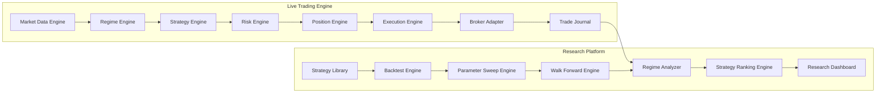
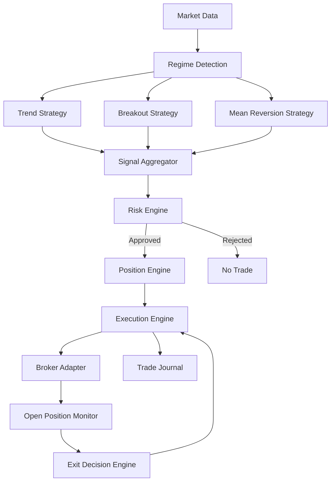
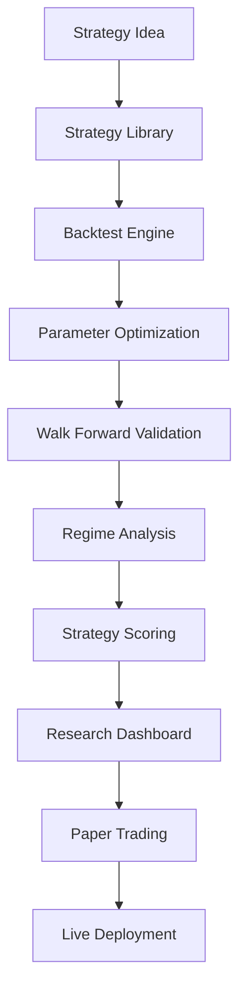
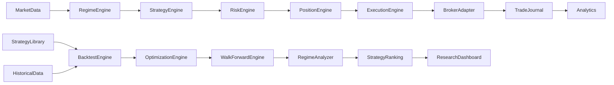

# Trading Operating System (TOS) + Research Platform Architecture

## Executive Summary

This platform is composed of two major subsystems:

1. **Live Trading Engine** (real-time execution)
2. **Research & Strategy Discovery Engine** (offline analysis)

The architecture separates research workloads from live trading to improve reliability, scalability, and risk control.

---

# High-Level Architecture

---

# Live Trading Workflow

---

# Research Workflow

---

# Module Dependency Diagram

---

# Core Modules

## Market Data Engine

Responsibilities:

- Live market feeds
- Historical market feeds
- Symbol metadata
- Corporate actions
- Session calendars

Dependencies:

- Broker APIs
- Data Vendors

---

## Regime Engine

Responsibilities:

- Trend classification
- Volatility classification
- Range detection
- Market state scoring

Outputs:

- Trending Bull
- Trending Bear
- Range
- High Volatility
- Low Volatility

---

## Strategy Engine

Responsibilities:

- Generate trade signals
- Maintain strategy state
- Produce confidence score

Examples:

- Trend Following
- Breakout
- Mean Reversion
- Momentum

---

## Risk Engine

Responsibilities:

- Daily loss limits
- Position limits
- Exposure limits
- Capital allocation
- Correlation controls

Decision:

- Approve Trade
- Reject Trade
- Resize Trade

---

## Position Engine

Responsibilities:

- Position sizing
- Scale-in logic
- Scale-out logic
- Trailing logic
- State-based exits

---

## Execution Engine

Responsibilities:

- Order placement
- Order modification
- Order cancellation
- Fill verification
- Retry logic

---

## Broker Adapter

Responsibilities:

- Broker abstraction
- Multi-broker support

Examples:

- Fyers
- Zerodha
- Alpaca

---

## Trade Journal

Responsibilities:

- Persist all orders
- Persist all fills
- Persist all decisions

Used by:

- Analytics
- Research Engine

---

# Research Platform Modules

## Strategy Library

Stores:

- Phoenix
- SuperTrend
- Donchian
- VWAP
- Opening Range Breakout

Versioned repository of strategies.

---

## Backtest Engine

Responsibilities:

- Historical simulation
- Trade generation
- Metric calculation

Outputs:

- CAGR
- Sharpe
- Profit Factor
- Drawdown

---

## Parameter Sweep Engine

Responsibilities:

- Grid Search
- Random Search
- Sensitivity Analysis

Purpose:

- Discover robust parameter ranges

---

## Walk Forward Engine

Responsibilities:

- Train / Validate cycles
- Out-of-sample testing
- Robustness verification

---

## Regime Analyzer

Responsibilities:

Determine:

- Which strategy works best in which regime

Example:

| Strategy | Trend | Range | Volatile |
|-----------|--------|--------|----------|
| Phoenix | 1.9 PF | 0.8 PF | 1.3 PF |
| Breakout | 1.2 PF | 0.7 PF | 2.0 PF |

---

## Strategy Ranking Engine

Ranking Metrics:

- Profit Factor
- Sharpe Ratio
- CAGR
- Drawdown
- Consistency
- Regime Stability

---

## Research Dashboard

Displays:

- Top strategies
- Worst strategies
- Regime performance
- Parameter robustness
- Walk-forward results

---

# Recommended Technology Stack

## Backend

- ASP.NET Core
- Worker Services

## Database

- PostgreSQL

## Cache

- Redis

## Messaging

- RabbitMQ (optional)

## UI

- Blazor Server

## Analytics

- Python (optional)
- Jupyter Notebooks

---

# Design Principles

1. Separate research from live trading.
2. Strategies are plug-ins.
3. Risk engine is independent of strategy logic.
4. Every decision is logged.
5. Regime detection precedes strategy execution.
6. Research findings require human approval before deployment.
7. Optimize portfolio performance, not individual trades.
